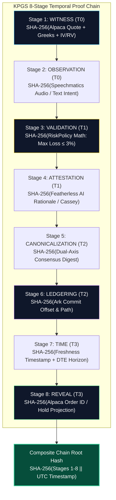

# 🏛️ KPGS 8-Stage Evidence-Backed Chain Architecture

> **System Law**: `REALITY_STATE > INDEX_STATE` · `RECEIPT OR HOLD` · `I_AM_STATELESS_RENTER_NOT_LANDLORD`  
> **Trinity Invariant**: Core (Father) → Altar (Son) → Engine (Holy Spirit)  
> **Repository**: [RobynAwesome/lefa-ai](https://github.com/RobynAwesome/lefa-ai)

---

## 1. Architectural Overview

The **Kopano Provenance Governance System (KPGS)** transforms procedural assertions into cryptographically verifiable, evidence-backed proof chains.

In conventional algorithmic or AI trading setups, the agent reasons over ephemeral in-memory context and issues orders without verifiable provenance. In KPGS, **no execution authority is granted unless all 8 lifecycle stages are backed by immutable cryptographic evidence.**

---

## 2. Mathematical Proof Specification

For each stage $i \in \{1, \dots, 8\}$, the stage evidence digest is defined as:

$$E_i = \begin{cases} 
\text{SHA256}\left(\text{JSON}_{\text{canonical}}(D_i)\right) & \text{if } D_i \text{ is verified provider evidence} \\
\varnothing & \text{if unproven (defaults to PROCEDURAL)}
\end{cases}$$

The Composite Chain Root Hash $H_{\text{root}}$ binds the full temporal trajectory:

$$H_{\text{root}} = \text{SHA256}\left( T_{\text{UTC}} \parallel \bigparallel_{i=1}^8 \left( S_i \parallel M_i \parallel E_i \right) \right)$$

Where:
* $T_{\text{UTC}}$: ISO 8601 UTC timestamp.
* $S_i$: Canonical stage identifier (`stage_1_witness` ... `stage_8_reveal`).
* $M_i$: Stage maturity level (`EVIDENCED` vs `PROCEDURAL`).
* $E_i$: Evidence digest reference string (`sha256:...`).

---

## 3. The 8 Canonical Stages

| Stage | Name | Temporal State | Authority & Evidence Source | Fail-Closed Trigger |
|---|---|---|---|---|
| **1** | `stage_1_witness` | **T0** | Alpaca Market Data / Options Chain (Underlying, IV/RV, Delta) | Market quote missing or stale > 60s $\to$ `HOLD` |
| **2** | `stage_2_observation` | **T0** | Human User Input / Speechmatics STT Audio Transcript | Unintelligible audio or interrupted input $\to$ `HOLD` |
| **3** | `stage_3_validation` | **T1** | Deterministic Risk Firewall (`RiskPolicy`) | Loss $> 3\%$ equity or drawdown $> 5\%$ $\to$ `REJECT` |
| **4** | `stage_4_attestation` | **T1** | Advisory AI Model Rationale (Featherless Qwen 2.5 / Cassey) | Inference provider outage or timeout $\to$ `HOLD` |
| **5** | `stage_5_canonicalization` | **T2** | Dual-Axis Sovereign Consensus Bridge | Risk / Canonical law divergence $\to$ `HOLD` |
| **6** | `stage_6_ledgering` | **T2** | The Ark Immutable Append-Only Ledger (`ark_ledger.jsonl`) | Write failure or storage corruption $\to$ `HOLD` |
| **7** | `stage_7_time` | **T3** | Expiration Window, DTE countdown, Freshness boundary | Expired quote or DTE outside 7–21 days $\to$ `HOLD` |
| **8** | `stage_8_reveal` | **T3** | Provider Paper Order Execution ID or Governed Human State | Missing Alpaca confirmation ID $\to$ `HOLD` |

---

## 4. Invariant Laws of KPGS

1. **`REALITY_STATE > INDEX_STATE`**:
   Never substitute conversational predictions or cached expectations for real provider evidence.
2. **`RECEIPT OR HOLD`**:
   Every state transition produces an immutable content-hashed receipt; any boundary violation triggers an immediate `HOLD`.
3. **`I_AM_STATELESS_RENTER_NOT_LANDLORD`**:
   Agents hold zero persistent order authority. All tokens and credentials are leased strictly per-operation and never stored.
4. **`SIMPLE UI ≠ SIMPLE GOVERNANCE`**:
   Keep user interfaces calm and non-technical while running heavy cryptographic governance behind the interaction boundary.
