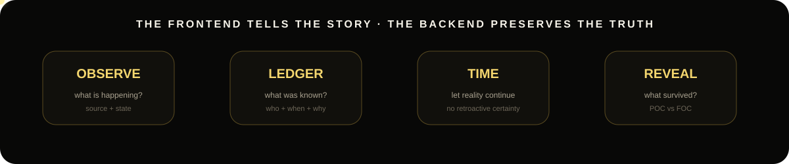
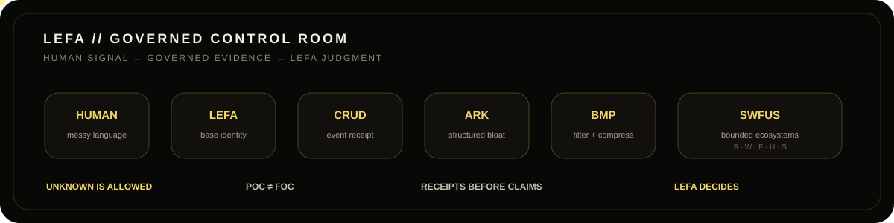
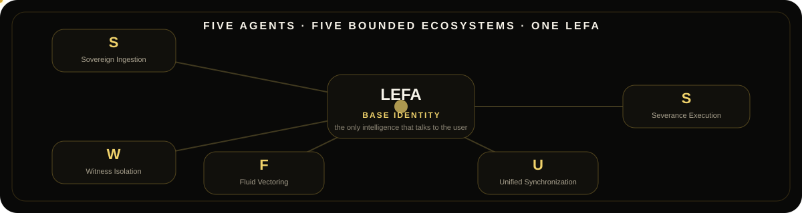

<p align="center">
  
</p>

<div align="center">
  
  
  
  
</div>

<p align="center">
  <strong>Your companion for governed financial intelligence.</strong><br/>
  <em>FI through AI, powered by SI.</em>
</p>

<p align="center">
  🇿🇦 <strong>Built in South Africa.</strong> · POC before narrative · receipts before claims · time reveals
</p>

---

<div align="center">
  <a href="https://lefa-core-live.vercel.app/"></a>
  <a href="./submission/one-page-writeup.md"></a>
  <a href="#-options-alpha-strategy--risk-governance"></a>
</div>

---

## 👋 Meet LEFA

<p align="center">
  <a href="./assets/companion/lefa-companion-root.jpg">
    
  </a>
  <a href="./assets/companion/lefa-companion-root.svg">
    
  </a>
</p>

<p align="center"><sub>Canonical source → animated interface interpretation. The drawing owns identity; the interface may evolve around it.</sub></p>

Most finance products introduce themselves with charts, balances and buttons.

**LEFA starts with a companion.**

You speak to **LEFA**. LEFA is the user-facing base intelligence. The complicated architecture underneath exists to help LEFA make a better decision — not to make the user learn the architecture.

> **You bring the human question. LEFA brings governed financial intelligence.**

---

## ⚡ Options Alpha Strategy & Risk Governance

Built specifically for the **Alpaca AI Trading Agents Hackathon** (Track: *Options Alpha Agents*):

- **AI Logic**: when `FEATHERLESS_API_KEY` is configured, Featherless AI (`Qwen/Qwen2.5-7B-Instruct`) explains the real provider evidence supplied to it. If inference is unavailable, the camera-safe lane returns `HOLD`; it does not substitute canned reasoning.
- **Current execution POC**: live-evidence selection of a defined-risk **bull put vertical credit spread** on the governed universe (`SPY`, `QQQ`, `AAPL`, `NVDA`). Bear-call spreads and iron condors remain broader strategy designs; they are not claimed as provider-execution proof by the current demo runner.
- **Delta Targeting**: the current candidate selector requires the short put to fall within `0.15–0.20` absolute delta.
- **Volatility Premium Gate**: a candidate is admitted only when $\frac{\text{ATM IV}}{\text{20-session RV}} \ge 1.15$.
- **Current hard gates**: paper jurisdiction, protective long, live provider quotes/Greeks, max $3\%$ loss per structure, $12\%$ aggregate-risk policy, and a $5\%$ competition-baseline drawdown circuit breaker. Existing positions or open orders cause the camera-safe runner to `HOLD` rather than assume their risk is zero.
- **Lifecycle design**: 50% profit-taking and a 5 DTE time stop are strategy-management targets; the current camera-safe runner does not claim those exits as broker-receipted automation until TIME/REVEAL evidence exists.
- **Alpaca Developer Stack**: official Alpaca MCP V2 server for protocol/tool observation plus `alpaca-py` / Alpaca Trading API for the separately governed paper-order boundary.

📄 **Full Architecture & Risk Specifications**: [Read the One-Page Hackathon Write-Up](./submission/one-page-writeup.md)

---

<p align="center">
  
</p>

LEFA does not treat a convincing first answer as reality.

**Observe** what is happening. **Ledger** what was known. Let **time** continue. **Reveal** what survived.

> **The frontend tells the story. The backend preserves the truth. Time decides what survives.**

---

## 🧠 What moves under LEFA?

<p align="center">
  
</p>

The public experience stays light. The backend is intentionally heavy.

```text
HUMAN
  ↓
LEFA — base identity / final decision-maker
  ↓
CRUD — capture the event
  ↓
ARK — governed structured bloat
  ↓
BMP — stress-test, filter and compress
  ↓
MAO — route bounded responsibility
  ↓
SWFUS — five internal ecosystems
  ↓
EVIDENCE + RECEIPTS + UNCERTAINTY
  ↓
LEFA
  ↓
DECISION / EXPLANATION
```

The internal system does **not** replace LEFA's judgment. It filters unsupported certainty, preserves useful ambiguity, and returns better governed evidence to the base model.

<details>
<summary><strong>OPEN // Why the backend expands before it compresses</strong></summary>
<br/>

Human language can carry emotion, memory, contradiction, testimony, uncertainty and several valid meanings at once.

The ARK gives that ambiguity room to become **structured bloat** instead of prematurely flattening it into one intent. BMP then earns compression by stress-testing what should survive.

```text
HUMAN AMBIGUITY
      ↓
GOVERNED EXPANSION
      ↓
POC / FOC PRESSURE
      ↓
BMP FILTER + COMPRESSION
      ↓
BOUNDED DATA
```

**POC:** what can actually be supported.

**FOC:** what merely looks complete, plausible or polished.

</details>

---

## 🌱 Five agents. Five ecosystems. One LEFA.

<p align="center">
  
</p>

The five internal agents do **not** talk to the user. They receive governed information from LEFA's backend and operate inside bounded ecosystems.

| Lane | Ecosystem | Core concern |
| :---: | :--- | :--- |
| **S** | Sovereign Ingestion | What may enter as governed signal? |
| **W** | Witness Isolation | What must be preserved independently as testimony? |
| **F** | Fluid Vectoring | What interpretations or directions remain plausible? |
| **U** | Unified Synchronization | What accepted state must align before action? |
| **S** | Severance Execution | What must be cut, held or rejected? |

> **Rich at the center. Minimal at the edges.**

The agent receives its identity, role, hierarchy and boundary. It does not need the entire city. It needs its ecosystem.

---

## 🧊 POC vs FOC

LEFA grows through one loop:

```text
POC → TEST → FEEDBACK → IMPROVE → NEXT POC
```

A model can sound intelligent and still be wrong. A market can disagree. A beautiful interface can look finished while the backend remains unproven.

So LEFA keeps receipts.

<details>
<summary><strong>OPEN // The hackathon proof lane: Governed Options Alpha</strong></summary>
<br/>

```text
ALPACA MCP V2 OBSERVATION + TOOL DISCOVERY
                 ↓
REAL ALPACA MARKET / OPTIONS EVIDENCE
                 ↓
FEATHERLESS AI REASONING — OR HOLD
                 ↓
BULL-PUT VERTICAL CANDIDATE (7–21 DTE, |delta| 0.15–0.20, IV/RV >= 1.15)
                 ↓
DETERMINISTIC RISK FIREWALL (3% trade loss, 12% policy cap, 5% baseline drawdown stop)
                 ↓
CONTENT-HASHED EXECUTION INTENT
                 ↓
OPTIONAL `--execute` ALPACA PAPER ORDER
                 ↓
INDEPENDENT PROVIDER ORDER RE-READ
                 ↓
PROVIDER RECEIPT CONFIRMED — OR HOLD
                 ↓
TIME & REVEAL
```

**Autonomous ≠ Ungoverned. Execution-capable ≠ executed.**

The code can request a governed paper multi-leg order only after the preceding gates clear. LEFA calls execution proven for a run only when Alpaca returns a provider order ID and a separate provider read confirms the same order. It does not claim a fill unless Alpaca itself reports one.

> **Real provider evidence or HOLD. Receipt before claim.**

</details>

---

## 🎨 Heavy architecture. Light interface.

LEFA's visual identity is not decoration attached to a dashboard. The companion is the interface anchor.

- black, white and gold;
- calm, recognizable identity;
- circular / halo framing;
- motion maps to system state;
- financial truth must come from real providers, never invented UI values;
- the interface should become simpler as the backend becomes stronger.

Asset governance lives in [`./assets/INDEX.md`](./assets/INDEX.md).

---

## 🛠️ Current project seed

```text
lefa-ai/
├── assets/
│   ├── companion/
│   │   ├── lefa-companion-root.jpg  # canonical drawing source
│   │   └── lefa-companion-root.svg  # animated interface interpretation
│   ├── readme/
│   │   ├── meet-lefa-readme-hero.svg
│   │   ├── lefa-control-room.svg
│   │   ├── lefa-observe-ledger-reveal.svg
│   │   └── lefa-swfus-ecosystem.svg
│   └── INDEX.md
├── docs/
├── src/lefa/
├── tests/
├── .github/
├── .env.example
├── pyproject.toml
├── LEFA AI Logo.png
└── README.md
```

The code remains deliberately small while the architecture is being validated.

---

## ⚡ Run LEFA

```bash
python -m venv .venv
source .venv/bin/activate
pip install -e '.[dev,mcp]'
cp .env.example .env
pytest
```

Base CLI:

```bash
lefa
```

Real Alpaca MCP V2 protocol proof:

```bash
lefa-mcp-proof --symbol SPY
```

Camera-safe options cycle — no broker write:

```bash
python scripts/run_options_agent.py --symbol AUTO
```

Explicit Alpaca **paper** execution request after all gates clear:

```bash
python scripts/run_options_agent.py --symbol AUTO --execute
```

The last command is not a promise of a trade or fill. Provider rejection, missing evidence, unavailable AI, existing risk, or an inadmissible market candidate produces `HOLD`.

Keep credentials in your local `.env` or the appropriate secret manager. Never commit or print them.

---

## 🏁 The question

LEFA is not being built merely to answer:

> "Can an LLM place a trade?"

The question is:

> **Can one human-facing intelligence receive messy human intent, use governed internal agents and real financial evidence, preserve uncertainty instead of inventing certainty, and make a decision that time can later validate?**

<p align="center">
  <strong>OBSERVE → LEDGER → REVEAL</strong><br/>
  <strong>FI through AI, powered by SI.</strong><br/>
  <em>Heavy architecture. Light interface.</em>
</p>
