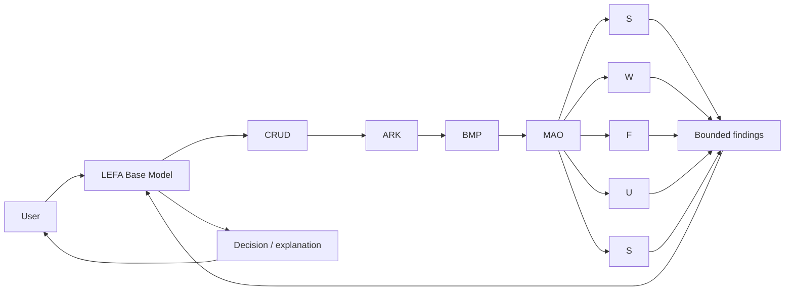
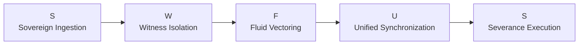

<p align="center">
  
</p>

<h1 align="center">LEFA AI</h1>
<p align="center"><strong>Your companion for governed financial intelligence.</strong></p>
<p align="center"><strong>FI through AI, powered by SI.</strong></p>
<p align="center">Built in South Africa 🇿🇦 · Alpaca AI Trading Agents Hackathon · POC first</p>

<div align="center">
  
  
  
</div>

---

## 👋 Meet LEFA

Most finance products introduce themselves with numbers, charts and buttons.

**LEFA starts with a companion.**

You talk to **LEFA**. LEFA listens, interprets, asks what matters, receives governed evidence from the backend, and comes back to you with a decision or explanation.

The financial layer is the benefit.

The product experience is the relationship:

> **You bring the human question. LEFA brings governed financial intelligence.**

LEFA is being designed around three connected ideas:

- **FI — Financial Intelligence:** financial context, market context, risk and outcomes;
- **AI — Artificial Intelligence:** the base intelligence that speaks with the user and makes the final judgment;
- **SI — Spiritual Intelligence:** the governance and value layer that asks what should survive, what should be held, and what should never be treated as truth without evidence.

The goal is not to make finance feel more complicated.

The goal is to make intelligence feel **understandable, trustworthy and alive**.

---

# 👁️ Observe → 📖 Ledger → ✨ Reveal

LEFA's public behavior should be simple enough to understand without an architecture document.

```text
OBSERVE
   ↓
LEDGER
   ↓
TIME
   ↓
REVEAL
```

**Observe** — something happened.

**Ledger** — preserve what was known, who knew it, when, why and from where.

**Time** — let reality continue instead of pretending the first prediction was automatically correct.

**Reveal** — compare the earlier belief with what reality eventually produced.

> **The frontend tells the story. The backend preserves the truth. Time decides what survives.**

---

# 🧠 What actually happens behind LEFA?

The user should not have to think about this every time they speak to LEFA.

But the system underneath is intentionally heavy.



### Dumbest possible explanation

```text
You talk.
   ↓
LEFA understands the human.
   ↓
The backend takes the messy meaning apart.
   ↓
It preserves the useful possibilities.
   ↓
It filters unsupported certainty.
   ↓
Five bounded agents investigate only their own lane.
   ↓
They return receipts, evidence, disagreement and uncertainty.
   ↓
LEFA makes the final decision.
   ↓
LEFA talks to you.
```

**LEFA is the base model.**

The five internal agents do **not** talk directly to the user. They exist underneath LEFA to make the base model's judgment better grounded.

---

# 🌱 Five internal ecosystems — SWFUS

LEFA currently explores five bounded internal lanes using the existing KPGS SWFUS structure.



The important idea is **boundary**.

Each internal agent receives only the governed information needed for its own ecosystem.

The Observer should not suddenly become the Executor.

The Witness should not rewrite history.

The analytical lane can explore possibilities without silently turning them into facts.

The severance lane can reject what does not survive governance.

> **Rich at the center. Minimal at the edges.**

---

# 🛶 The ARK: let the meaning expand before compression

Human language is messy because humans are not APIs.

One sentence can carry emotion, intention, uncertainty, memory, contradiction and multiple valid interpretations at the same time.

LEFA does not want to destroy that too early.

The ARK is where incoming CRUD information can become **governed structured bloat**: a wider field of possible meaning, provenance, known facts, unknowns, contradictions, testimony and candidate interpretations.

That is deliberate.

Then BMP can do what it was built to do:

```text
AMBIGUITY
   ↓
GOVERNED EXPANSION
   ↓
BMP FILTER / COMPRESSION
   ↓
POC survives
FOC is exposed / held
   ↓
BOUNDED AGENT DATA
```

The system is not trying to move hallucination around.

**It is trying to filter hallucination out before unsupported certainty reaches LEFA as truth.**

---

# 🧊 POC vs FOC

LEFA is built around one practical habit:

> **Do not confuse a convincing idea with a validated result.**

```text
POC → TEST → FEEDBACK → IMPROVE → NEXT POC
```

A model can make a strong argument.

A market can still disagree.

A beautiful interface can look finished.

The backend can still be unproven.

A prediction can sound intelligent.

Time can still reveal that it was wrong.

So LEFA keeps receipts.

---

# 🎨 Heavy architecture. Light interface.

The interface direction begins with the **LEFA companion**: black, white and gold; calm; recognizable; simple enough to become a living interface rather than a mascot beside another dashboard.

The companion is intended to carry system state visually over time:

- observing;
- thinking / waiting;
- governed hold;
- risk / protection;
- reveal;
- learning;
- temporal replay.

The backend may become complicated.

The user's experience should become **simpler**.

That is the design law:

> **Realism accommodates aesthetics. Aesthetics must help people understand reality.**

Asset governance and the visual registry live in [`assets/INDEX.md`](assets/INDEX.md).

---

# 🚪 Current hackathon POC

The first external reality proof remains intentionally bounded:

```text
CONNECT TO ALPACA PAPER ENVIRONMENT
                 ↓
OBSERVE REAL ACCOUNT / MARKET CONTEXT
                 ↓
PRESERVE SOURCE + TIME + PROVENANCE
                 ↓
LEFA RECEIVES GOVERNED FINDINGS
                 ↓
MAKE / EXPLAIN ONE GOVERNED DECISION
                 ↓
WAIT OR REPLAY TIME
                 ↓
COMPARE THESIS WITH OUTCOME
                 ↓
REVEAL
```

We are not proving autonomous finance in one sprint.

We are proving that **LEFA can observe reality, preserve what it knew, make a bounded judgment, and remain accountable to what happens next.**

---

# 🛠️ Current project seed

The repository currently includes:

- a Python package;
- a small CLI;
- Alpaca SDK integration;
- configuration support;
- governance experiments;
- tests and CI scaffolding;
- interface / asset governance planning;
- engine discovery issues for the next backend phase.

The code stays deliberately small while the architecture is being validated.

---

# ⚡ Run LEFA

```bash
python -m venv .venv
source .venv/bin/activate
pip install -e '.[dev]'
cp .env.example .env
pytest
```

CLI entry point:

```bash
lefa
```

Keep credentials in your local `.env` file. Never commit them.

---

# 🗂️ Repository map

```text
lefa-ai/
├── assets/           # governed visual identity + asset registry
├── docs/             # POC, interface and architecture discovery
├── src/lefa/         # LEFA Python package
├── tests/            # POC tests
├── .github/          # CI and repository automation
├── .env.example      # environment template
├── pyproject.toml    # Python project configuration
├── LEFA AI Logo.png  # canonical product logo
└── README.md          # public front door
```

---

# 🏁 The question

LEFA AI is being built to answer something larger than:

> "Can an LLM place a trade?"

The question is:

> **Can one human-facing intelligence receive messy human intent, use governed internal agents and real financial evidence, preserve uncertainty instead of inventing certainty, and make a decision that time can later validate?**

That is the POC.

---

<p align="center">
  <strong>Observe → Ledger → Reveal.</strong><br />
  <strong>FI through AI, powered by SI.</strong><br />
  <em>Heavy architecture. Light interface.</em>
</p>
