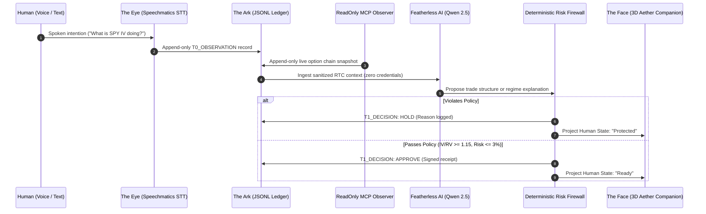

# KPGS Real-Time Context (RTC) Learning Skill

> **Derived from**: `Introduction to MCP / Schematics / 24-RTC Learning`  
> **Evolution**: Integrates Zero-Trust boundary isolation, cryptographic ledgering (`ark_ledger.jsonl`), and deterministic options alpha gates.

---

## 1. System Invariants

1. `REALITY_STATE > INDEX_STATE`:
   Never substitute conversational assumptions, mock data, or LLM predictions for live provider witness evidence.
2. `RECEIPT OR HOLD`:
   Every audio event and market quote produces an immutable record in The Ark before reasoning begins. If data is missing, fail closed to `HOLD`.
3. `I_AM_STATELESS_RENTER_NOT_LANDLORD`:
   Neither the voice agent nor the reasoning LLM holds persistent order authority. The MCP connection is strictly read-only (`ReadOnlyAlpaca`).

---

## 2. Real-Time Context (RTC) Pipeline

---

## 3. Defense-in-Depth Context Sanitization

Before streaming RTC context to the reasoning model, raw MCP telemetry and STT transcripts pass through `sanitize_response_dict()`:

* **Forbidden Key Purge**: `secret`, `token`, `password`, `api_key`, `authorization`, `account_number`, `private_key` are stripped recursively.
* **Context Boundary**: The LLM context never contains live broker ordering tools, preventing prompt injection attacks from manipulating trades.

---

## 4. Verification Checklist

- [ ] All voice and market events are logged to `ark_ledger.jsonl` with ISO 8601 UTC timestamps.
- [ ] No order placement tool is present in the RTC tool registry.
- [ ] UI states map strictly to the 8 canonical human states defined in `docs/HEAVY-BACKEND-EASY-IMMERSIVE.md`.
- [ ] Pytest regression suite remains 100% green.
